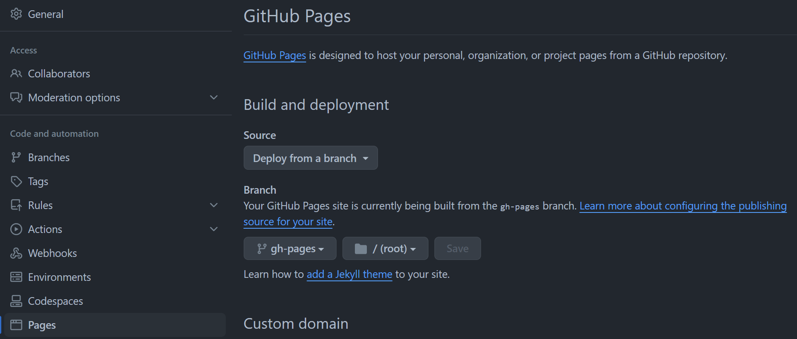

+++
archetype = "home"
title = ""
+++

This is a C# workshop and other know-how pages.

## action　設定

公式の説明に従って設定
https://github.com/peaceiris/actions-hugo

## github Actions Error

  remote: Permission to teshiba/csworkshop.git denied to github-actions[bot].
  fatal: unable to access 'https://github.com/teshiba/csworkshop.git/': The requested URL returned error: 403
  Error: Action failed with "The process '/usr/bin/git' failed with exit code 128"

  Acions設定から権限を与える
Settings > Actions > general > Workflow permissionsから権限を与えます。
Read and writeを選択します。

workflow完了後公開設定

